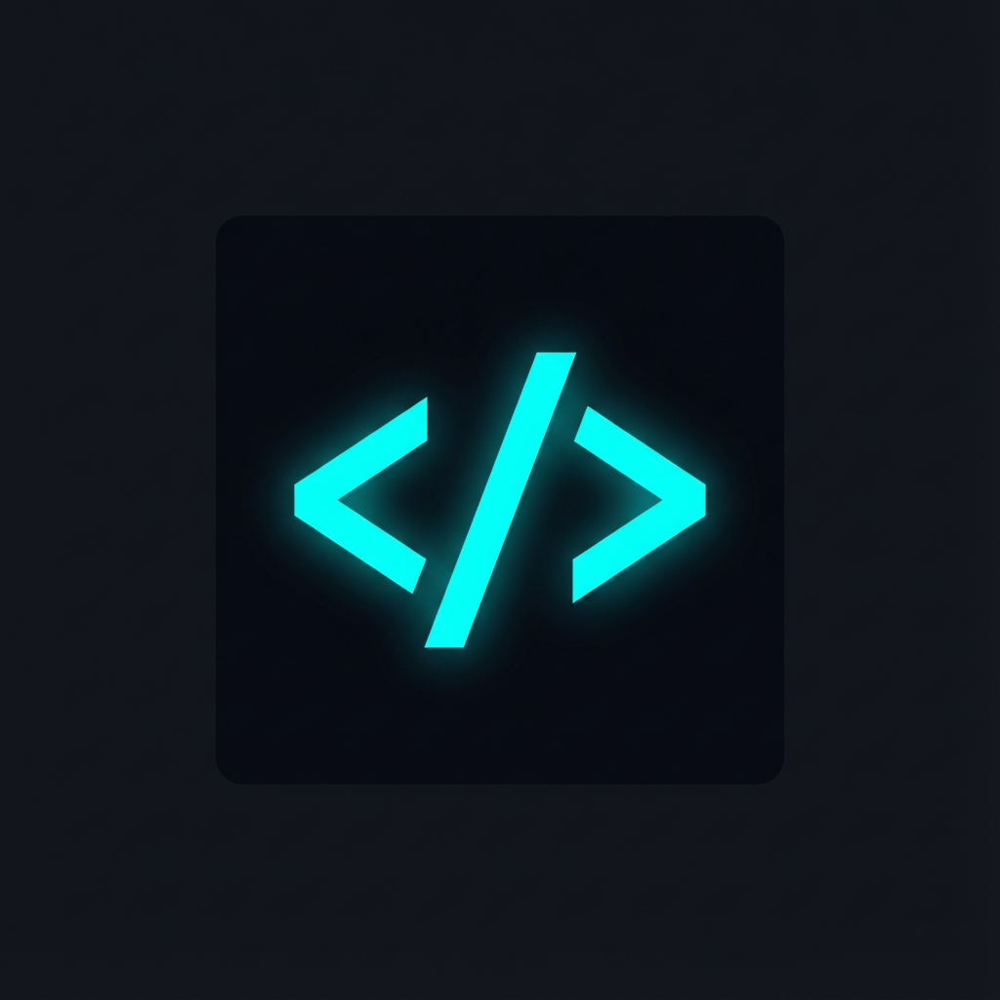
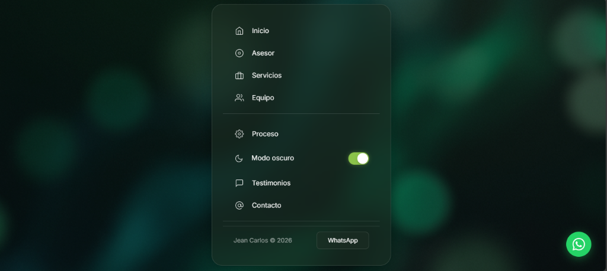

<p align="center">
  
</p>

<h1 align="center">🚀 Consultor Tech & Mentor en IA</h1>

<p align="center">
  <strong>Página de consultoría tecnológica, mentoría académica y soluciones con Inteligencia Artificial</strong>
</p>

<p align="center">
  <a href="https://consultor-tech.vercel.app/">
    
  </a>
  
  
  
</p>

---

## 👀 Vista Previa

<p align="center">
  
</p>

<p align="center">
  <em>Menú principal tipo Hub con efecto Glassmorphism y modo oscuro</em>
</p>

---

## 📋 Tabla de Contenidos

- [👀 Vista Previa](#-vista-previa)
- [📖 Descripción](#-descripción)
- [✨ Características](#-características)
- [🎨 UI/UX y Decisiones de Diseño](#-uiux-y-decisiones-de-diseño)
- [🏗️ Arquitectura del Proyecto](#️-arquitectura-del-proyecto)
- [🚀 Cómo Ejecutar Localmente](#-cómo-ejecutar-localmente)
- [📱 Responsive Design](#-responsive-design)
- [🛠️ Tecnologías Utilizadas](#️-tecnologías-utilizadas)
- [📞 Contacto](#-contacto)

---

## 📖 Descripción

**Consultor Tech** es una página web profesional diseñada para ofrecer servicios de:

- 🎓 **Mentoría académica** para estudiantes universitarios
- 💼 **Consultoría tecnológica** para profesionales y negocios
- 📚 **Capacitación en IA** para educadores
- 🖥️ **Soporte técnico y hardware** a través de nuestro especialista

La página está desplegada en **Vercel** y accesible en:  
🔗 **[https://consultor-tech.vercel.app/](https://consultor-tech.vercel.app/)**

---

## ✨ Características

### 🎯 Sistema Pathfinder (Asesor Inteligente)
Un wizard interactivo que guía a los visitantes a través de preguntas para identificar el servicio que mejor se adapta a sus necesidades. Simula una experiencia de terminal con prompts del estilo `> ¿Cuál es tu perfil?`

### 🌙 Modo Oscuro/Claro
Toggle dinámico entre temas con transiciones suaves y colores optimizados para cada modo.

### 💬 Formulario de Contacto Funcional
Integrado con **Web3Forms** para envío de emails sin necesidad de backend.

### 📱 Botón Flotante de WhatsApp
Acceso directo a chat de WhatsApp para comunicación inmediata con los clientes.

### 🖥️ Testimonios Estilo Terminal
Sección de testimonios diseñada como una consola de logs, manteniendo la estética tech del sitio.

### 👥 Cards de Equipo con Código JSON
Presentación del equipo con snippets de código JSON que muestran especialidades y tecnologías.

---

## 🎨 UI/UX y Decisiones de Diseño

### Filosofía de Diseño

El diseño de **Consultor Tech** se basa en tres pilares fundamentales:

#### 1. 🪟 Glassmorphism Moderno
Elegimos el estilo **glassmorphism** (efecto de cristal translúcido) porque:

- Transmite **modernidad y sofisticación** tecnológica
- Crea una jerarquía visual clara con capas de transparencia
- Combina perfectamente con fondos abstractos y dinámicos
- Refleja la naturaleza "transparente" de los servicios de consultoría

```css
/* Ejemplo del efecto glassmorphism implementado */
.menu-panel {
  background: rgba(30, 30, 30, 0.85);
  backdrop-filter: blur(20px);
  -webkit-backdrop-filter: blur(20px);
  border: 1px solid rgba(255, 255, 255, 0.1);
}
```

#### 2. 🧭 Navegación Hub-Centric (SPA)
En lugar de una navegación tradicional con navbar, implementamos un **menú central tipo hub**:

- **¿Por qué?** Los visitantes llegan con diferentes necesidades (estudiante, profesional, educador)
- El hub presenta todas las opciones de forma equitativa
- Evita la sensación de "scroll interminable"
- Cada sección se despliega de forma independiente con animaciones suaves
- Botón de "Menú" siempre visible para regresar al hub

#### 3. 🌈 Paleta de Colores y Tipografía

| Elemento | Color | Propósito |
|----------|-------|-----------|
| Primario | `#6366f1` (Indigo) | Acciones principales, CTAs |
| Éxito | `#22c55e` (Verde) | Confirmaciones, estados positivos |
| Background Dark | `#0a0a0a` | Fondo modo oscuro |
| Background Light | `#f4f4f5` | Fondo modo claro |
| Texto | `#fafafa` / `#18181b` | Alto contraste para legibilidad |

**Tipografía:** [Inter](https://fonts.google.com/specimen/Inter) - Una fuente moderna, limpia y altamente legible diseñada específicamente para interfaces digitales.

---

### Decisiones UX Clave

#### 🎯 Pathfinder: Reducir la Fricción
El problema común en páginas de servicios es que los visitantes no saben qué necesitan. El **Pathfinder** resuelve esto:

1. Pregunta el **perfil** del usuario (estudiante/profesional/educador)
2. Según su respuesta, muestra opciones **contextualizadas**
3. Presenta una **recomendación personalizada**
4. Ofrece un CTA claro: "Agendar consulta"

#### ⚡ Micro-interacciones
Cada elemento interactivo tiene feedback visual:
- Hover effects con transiciones de 300ms
- Escalado sutil en botones (1.02x)
- Cambios de color graduales
- Animaciones de entrada para secciones

#### 📊 Comparación Antes/Después
En la sección de servicios profesionales, incluimos un **comparador visual** que muestra el ahorro de tiempo con automatización IA - comunicando valor de forma inmediata sin texto extenso.

---

## 🏗️ Arquitectura del Proyecto

```
consultor-tech/
├── 📄 index.html          # Estructura HTML principal
├── 📄 styles.css          # Estilos consolidados (producción)
├── 📄 script.js           # JavaScript consolidado (producción)
├── 📁 assets/
│   ├── 🖼️ background.png  # Fondo abstracto
│   └── 🖼️ favicon.png     # Ícono del sitio
├── 📁 css/                # Estilos modularizados
│   ├── 📄 main.css        # Importador principal
│   ├── 📁 base/           # Variables y reset
│   ├── 📁 components/     # Botones, formularios, cards
│   ├── 📁 sections/       # Estilos por sección
│   ├── 📁 layouts/        # Grid y estructura
│   └── 📁 utilities/      # Animaciones, helpers
└── 📁 js/                 # JavaScript modularizado
    ├── 📄 app.js          # Punto de entrada
    ├── 📁 core/           # Event bus, utilidades
    ├── 📁 data/           # Datos del Pathfinder
    └── 📁 modules/        # Módulos funcionales
```

### Arquitectura CSS

El CSS está organizado siguiendo la metodología **ITCSS** (Inverted Triangle CSS):

1. **Base**: Variables CSS, reset, tipografía
2. **Components**: Elementos reutilizables (botones, cards, formularios)
3. **Layouts**: Sistemas de grid y contenedores
4. **Sections**: Estilos específicos por sección
5. **Utilities**: Animaciones y helpers

### Arquitectura JavaScript

El JavaScript utiliza un patrón **modular con Event Bus**:

- **Core**: Sistema de eventos centralizado
- **Modules**: Funcionalidades independientes (Pathfinder, ContactForm, etc.)
- **Data**: Configuraciones y datos estáticos

---

## 🚀 Cómo Ejecutar Localmente

### Opción 1: Servidor de Desarrollo (Recomendado)

```bash
# Clonar el repositorio
git clone https://github.com/tu-usuario/consultor-tech.git
cd consultor-tech

# Usar cualquier servidor HTTP local, por ejemplo:
npx serve
# o
python -m http.server 8000
# o con Live Server en VS Code
```

### Opción 2: Abrir Directamente

Simplemente abre `index.html` en tu navegador.

> **Nota:** Algunas funcionalidades como el formulario de contacto requieren un servidor HTTP.

---

## 📱 Responsive Design

La página está completamente optimizada para todos los dispositivos:

| Breakpoint | Dispositivo | Adaptaciones |
|------------|-------------|--------------|
| `< 480px`  | Móviles pequeños | Menú compacto, cards apiladas |
| `480-768px` | Móviles/Tablets | Grid de 1-2 columnas |
| `768-1024px` | Tablets | Menú expandido, grid adaptativo |
| `> 1024px` | Desktop | Diseño completo con todos los elementos |

### Características Mobile-First
- Touch targets de mínimo 44px
- Scroll suave entre secciones
- Menú adaptativo con animaciones
- Botón de WhatsApp siempre accesible

---

## 🛠️ Tecnologías Utilizadas

### Frontend
- **HTML5** - Estructura semántica con SEO optimizado
- **CSS3** - Variables CSS, Flexbox, Grid, Animaciones
- **JavaScript ES6+** - Módulos, Event Bus, async/await

### Servicios
- **[Web3Forms](https://web3forms.com/)** - Manejo de formularios sin backend
- **[Vercel](https://vercel.com/)** - Hosting y despliegue continuo
- **[Google Fonts](https://fonts.google.com/)** - Tipografía Inter

### Efectos y UI
- **Glassmorphism** - `backdrop-filter: blur()`
- **CSS Custom Properties** - Sistema de temas dinámico
- **CSS Transitions & Animations** - Micro-interacciones fluidas

---

## 📞 Contacto

| Canal | Enlace |
|-------|--------|
| 🌐 **Sitio Web** | [consultor-tech.vercel.app](https://consultor-tech.vercel.app/) |
| 💬 **WhatsApp** | [+506 6176-3452](https://wa.me/50661763452) |
| 📧 **Formulario** | Disponible en la sección de Contacto del sitio |

---

<p align="center">
  <strong>Desarrollado con 💜 por Jean Carlos</strong>
</p>

<p align="center">
  <sub>© 2026 Consultor Tech. Todos los derechos reservados.</sub>
</p>
